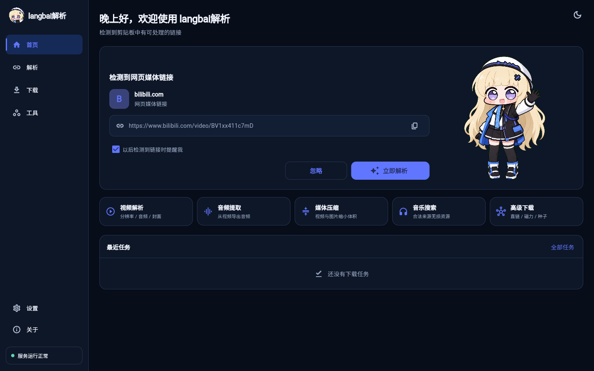

# langbai解析

`langbai解析` 是面向 Windows、Android、iOS 和 Web 的公开媒体解析、转换与下载工作台。Windows、Android 与 iOS 安装包均可在设备本机解析，不要求用户连接公益解析服务器。



## 主要能力

- 使用 yt-dlp 2026.07.04 的 1,700+ 个站点解析器并提供通用网页兜底，可选择视频分辨率、音频、封面和图片。
- 静态网页媒体嗅探、单链接八段并发、多镜像线路交叉下载、磁力链接和 `.torrent` 种子任务。
- 本地视频提取音频、视频压缩、图片压缩和媒体信息读取。
- 聚合 Internet Archive、Wikimedia Commons、Audius、Apple Music 和 MusicBrainz；仅对来源明确授权的文件提供下载。
- Windows 软件内下载 Setup、SHA-256 校验并启动静默更新；Android、iOS、Web 启动时统一检测更新。
- Windows Setup 内置本地解析服务、FFmpeg 和 aria2；Android APK 内置 Python、yt-dlp、QuickJS、FFmpeg 和 aria2；iOS IPA 内嵌 Python 与 yt-dlp。
- 自适应桌面侧边栏和移动端底部导航，支持深色、浅色、跟随系统和桌面端默认保存路径。

> 网站接口、登录策略和风控会变化，因此无法承诺“所有网站永久适配”。是否支持应以实际链接测试为准。项目只处理公开、无 DRM 且用户有权保存的内容，不绕过付费、私密、地区限制或访问控制。客户端不读取浏览器 Cookie，需要登录的内容不属于匿名解析范围。

抖音公开作品优先通过移动匿名分享页的 `_ROUTER_DATA` 直接解析，Windows、Android 与 iOS 均不读取 Cookie；专用入口失效时会明确提示更新解析器。
可以直接粘贴“复制打开抖音”生成的整段分享文案，langbai解析会自动提取其中的第一个 HTTP 链接。

## 目录

```text
client/                 Flutter 全平台客户端
backend/                FastAPI + yt-dlp + FFmpeg + aria2 服务
installer/windows/      Inno Setup 安装器配置
scripts/                构建、发布清单和维护脚本
.github/workflows/      APK、IPA、Web、Setup 和 Release 自动化
```

## 本机启动

Windows PowerShell：

```powershell
.\scripts\start_backend.ps1
Set-Location .\client
flutter run -d windows
```

后端接口文档位于 `http://127.0.0.1:8787/docs`。Android 与 iOS 正式安装包默认调用设备内置解析器，不访问该地址。

Docker 部署：

```powershell
docker compose up -d --build
```

生产环境应限制 `MEDIA_HARBOR_CORS_ORIGINS`，并在反向代理增加认证、限速、上传大小限制和出口隔离。解析器仅处理无需登录的公开内容，不配置或读取浏览器 Cookie。

## 构建

Windows Setup（需要 Flutter、Visual Studio C++ 桌面工作负载和 Inno Setup 6）：

```powershell
.\scripts\build_windows_setup.ps1 `
  -Version "1.0.6" `
  -UpdateManifestUrl "https://github.com/你的账号/langbai-resolver/releases/latest/download/update-manifest.json"
```

输出为 `dist/langbai-resolver-Setup.exe`。

Android APK：

```powershell
.\scripts\build_android.ps1 `
  -ApiBaseUrl "https://你的解析服务域名" `
  -UpdateManifestUrl "https://github.com/你的账号/langbai-resolver/releases/latest/download/update-manifest.json"
```

iOS 必须在 macOS/Xcode 环境构建。构建脚本会下载 Python Apple Support 并把 yt-dlp 封装进 IPA；`build-unsigned-ipa.yml` 可生成未签名 IPA，安装前仍需使用自己的 Apple 证书签名。已配置签名环境时可运行：

```bash
API_BASE_URL="https://你的解析服务域名" \
UPDATE_MANIFEST_URL="https://github.com/你的账号/langbai-resolver/releases/latest/download/update-manifest.json" \
./scripts/build_ipa.sh --export-options-plist=../ios/ExportOptions.ad-hoc.plist
```

## GitHub Release 与自动更新

推送 `v1.0.6` 形式的标签，`release.yml` 会自动生成并发布：

- `langbai-resolver-Setup.exe`
- `langbai-resolver-Android.apk`
- `langbai-resolver-iOS.ipa`
- `langbai-resolver-Web.zip`
- `update-manifest.json`

客户端默认从 Release 的 `latest/download/update-manifest.json` 检查版本。后端也提供 `/api/v1/update` 作为可自托管的更新清单入口，对应环境变量记录在 `backend/.env.example`。

## 测试

```powershell
Set-Location .\backend
..\.venv\Scripts\python.exe -m pytest -q

Set-Location ..\client
flutter analyze
flutter test
```
