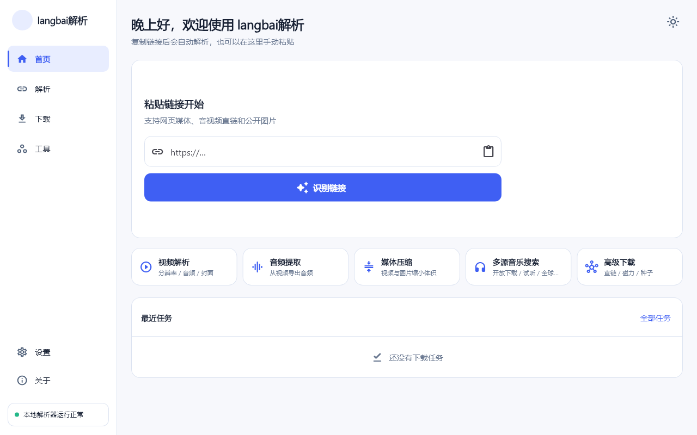
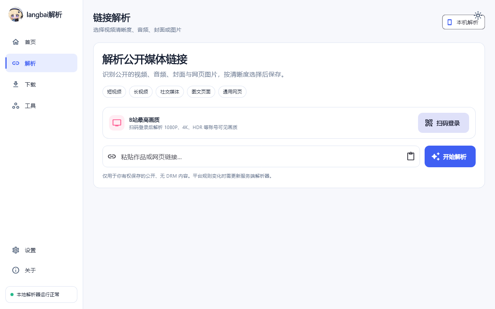
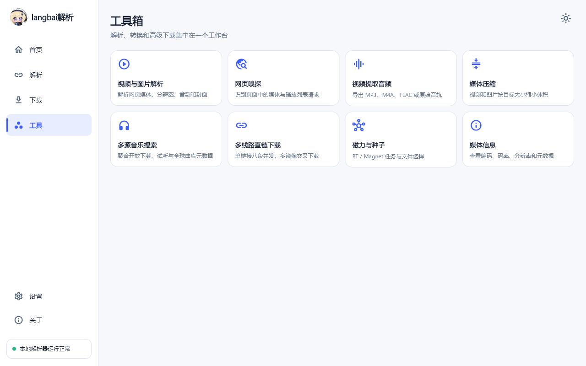
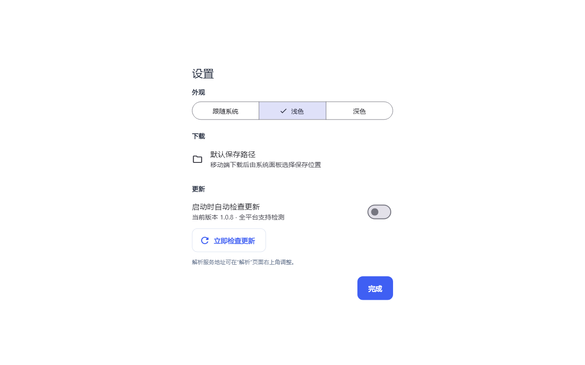
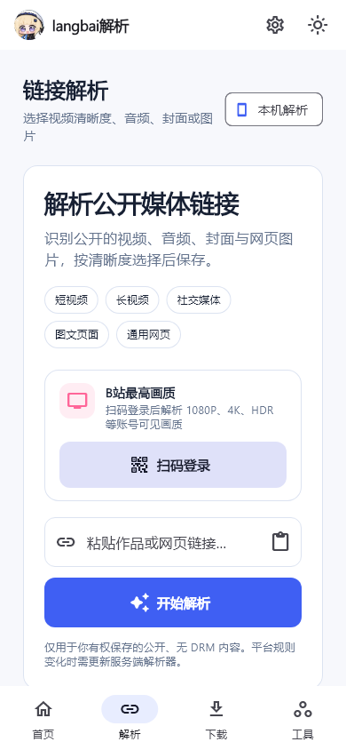
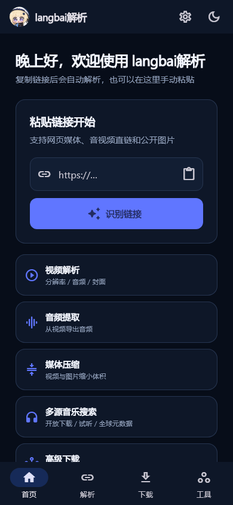
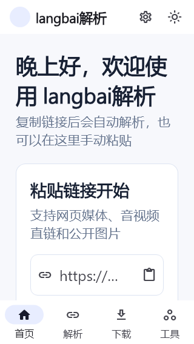

# langbai解析深度审计报告

审计日期：2026-07-11
审计对象：`2786886095/langbai-resolver` 当前工作树（基线提交 `ce8b565`，含审计开始前已有的 8 个未提交产品改动）
覆盖范围：Flutter 客户端、Windows Runner 与 Setup、Android/Kotlin、iOS/Swift/Python、Python/FastAPI 后端、下载与转换链、更新系统、GitHub Actions、发布资产、明/暗主题与手机/桌面响应式。
审计方式：只读代码审计、当前运行截图、静态分析、依赖/供应链扫描、单元测试、Android Lint、有限的公开链接在线验证。未修复产品源码。

## 结论

当前版本**不建议继续作为“Windows、Android、iOS、Web 全端正式版”发布**。本轮汇总出 **61 组潜在问题**：P0 1 组、P1 18 组、P2 33 组、P3 9 组。

最关键的事实是：

1. GitHub Release 中的 IPA 是未签名包，普通 iPhone 无法完成安装；这直接解释“一直安装但装不上”。Apple 的正式设备分发需要签名证书和 provisioning profile，或通过 TestFlight/App Store 分发。[Apple 设备分发说明](https://developer.apple.com/documentation/xcode/distributing-your-app-to-registered-devices)
2. Android/iOS 只有“链接解析”和“音乐搜索”真正本地化；网页嗅探、音频提取、压缩、直链、磁力、种子、媒体信息仍请求手机自己的 `127.0.0.1:8787`，新装手机必然连接失败。
3. 后端存在可外带响应的 SSRF 路径、Windows 本地端口冒充可窃取 B站会话、iOS 直链下载可把 B站 Cookie 发往任意提取结果主机。
4. Windows Setup 未签名；发布工作流存在 shell 注入入口、过宽权限、未固定 Action 与未保护主分支等供应链风险。
5. “支持所有国内外视频软件”无法由当前实现和测试保证。当前 yt-dlp 列出 1752 个 extractor，但列表中本身含 `CURRENTLY BROKEN` 项；Windows/Docker 包还缺少 YouTube 当前要求的 EJS 与可用 JS runtime 配置。

严重度定义：P0 = 当前发行或核心目标直接不可用；P1 = 高风险安全问题或大范围核心功能失效；P2 = 重要可靠性、兼容性、数据完整性或测试问题；P3 = 体验、可访问性、文案和维护性问题。

## 当前界面证据

### 1. 桌面首页 — 健康度：良好，但能力承诺过宽

视觉层级、留白、快速入口和品牌形象已经统一；主要问题不在这一屏的样式，而在入口后面的能力在不同平台并不等价。

### 2. 桌面解析页 — 健康度：有风险

B站登录入口已经比旧版紧凑，但 Windows 会把登录 Cookie 发给固定的本地 8787 端口；该端口可被其他本地进程抢占。解析结果也没有把编码兼容性清楚展示给用户。

### 3. 桌面工具页 — 健康度：桌面部分可用，手机/Web 大面积失效

八张工具卡等权展示，但没有“仅 Windows/需后端/手机不可用”的能力标签。Android/iOS/Web 用户会看到相同入口，随后才遇到网络错误。

### 4. 设置弹窗 — 健康度：有风险

保存路径和更新控制清晰；“全平台支持检测”会掩盖 iOS 包不可安装、iOS 解析器更新为空操作、Android ABI 更新包不兼容等差异。

### 5. 手机解析页 — 健康度：可用主流程，但有兼容/隐私风险

手机窄屏下 B站卡片已经改为纵向布局；副标题换行略碎，二维码流程没有“打开哔哩哔哩”，单设备用户操作不完整。

### 6. 手机深色首页 — 健康度：视觉良好

明暗主题的色彩与组件结构一致。主要风险仍是启动/回前台读取剪贴板并自动联网解析，以及功能入口没有平台可用性提示。

### 7. 320×568、150% 字号 — 健康度：需优化

本次未复现 RenderFlex 溢出，但首屏信息密度显著下降，标题被拆成两行，主卡片核心动作落到折叠线附近。应继续验证 200% 字号、系统粗体、不同中文字体和屏幕高度。

## P0：发行阻断

### LB-001 — 官方 IPA 未签名，普通 iPhone 无法安装

- 证据：`.github/workflows/release.yml:108-121` 两次使用 `--no-codesign`，再直接把 `Runner.app` 压成 IPA；`scripts/create_update_manifest.py:39` 又把它写成正式更新地址。
- 客户端 `client/lib/services/update_installer_io.dart:19-24` 只打开下载 URL，没有 TestFlight、App Store、Ad Hoc/企业签名或 `itms-services` 安装链。
- 影响：用户看到“安装中”但系统最终不接受包；应用内更新同样无解。
- 正确方向：建立 Apple Developer 签名、Archive/Export、TestFlight 或受控 Ad Hoc 流程。Apple 官方建议先创建 archive，再按 TestFlight/App Store、Release Testing 等方式签名分发。[Apple 分发文档](https://developer.apple.com/documentation/xcode/distributing-your-app-for-beta-testing-and-releases)

## P1：必须在下一版发布前解决

### LB-002 — 手机端六类核心工具默认必然连接失败

`client/lib/pages/tools_page.dart:15-18,257-303` 默认请求 `http://127.0.0.1:8787`；只有音乐搜索走手机直连实现。Android/iOS 没有在本机启动对应 FastAPI/FFmpeg/aria2 工具后端，网页嗅探、提音频、媒体压缩、直链、磁力/种子、媒体信息均会 `Connection refused`。

### LB-003 — 发布的 Web 版本默认同样不可用

Release 会生成 Web.zip，但 `.github/workflows/release.yml:145` 没有注入 `API_BASE_URL`；Web 客户端继续访问访问者设备的 `127.0.0.1:8787`。这不是可独立使用的 Web 产品，也没有公开服务、鉴权、配额或部署说明闭环。

### LB-004 — 重定向与 DNS 重绑定绕过 SSRF，并可回读内网响应

`backend/app/services/security.py:32` 只在请求前解析一次 DNS；`jobs.py:275,385` 随后允许自动跳转，未逐跳验证或固定已验证 IP。最终响应会在 `jobs.py:432` 落盘并由 `main.py:124` 返回。OWASP 明确建议禁用自动重定向或逐跳校验，并防御 DNS pinning。[OWASP SSRF 防护](https://cheatsheetseries.owasp.org/cheatsheets/Server_Side_Request_Forgery_Prevention_Cheat_Sheet.html)

### LB-005 — M3U8、Magnet、Torrent 的嵌套地址绕过 URL 校验

上传的播放列表会直接交给 FFmpeg/FFprobe（`jobs.py:464,530,566`），Magnet/Torrent 原样交给 aria2（`jobs.py:605`）；未限制协议、tracker、Web Seed 或网络命名空间。攻击者可让工具访问内网资源。

### LB-006 — Windows 8787 端口可被冒充并窃取 B站会话

`client/windows/runner/main.cpp:34-58` 只判断 8787 是否能连接；任何先占端口的进程都会被当作可信后端。`parser_page.dart:172-180` 和 `api_client.dart:39-49` 随后会把 B站 Cookie 发送过去。缺少随机端口、每次启动令牌、进程身份或双向握手。

### LB-007 — iOS 把完整 B站 Cookie 发送给任意直链主机

`client/ios/Runner/app/resolver_bridge.py:663-715` 接收提取器直链，`:727-732` 缓存 B站 Cookie，`:777-795` 在下载任意 direct URL 时无目标域限制地添加 `Cookie`。跨域 CDN 或恶意重定向可拿到 `SESSDATA`。

### LB-008 — 公网后端无认证、无速率和资源额度，可被耗尽

`docker-compose.yml:6` 默认公开 8787，CORS 默认 `*`；单文件允许 4 GB，上传限制发生在 multipart 已接收之后。任务队列、解析缓存、页面响应体、磁盘下载均无总量上限。定向验证中缓存可连续增长到 1000 项。

### LB-009 — Release 的版本输入可直接注入 runner shell

`.github/workflows/release.yml:38,76,110,142,166,173` 把 `${{ inputs.version }}` 直接插入 PowerShell/Bash。workflow_dispatch 用户输入可结束引号并执行命令；Android job 同时接触签名密钥。GitHub 官方要求把不可信表达式先传入中间环境变量，避免写进临时 shell 脚本。[GitHub 脚本注入说明](https://docs.github.com/en/actions/concepts/security/script-injections)

### LB-010 — GitHub Actions 供应链权限过宽

Release 顶层设置 `contents: write`，多个第三方 Action 未固定完整 commit SHA，checkout 保留凭据；主分支无保护规则、仓库无 ruleset，Dependabot alerts 与 code scanning 未启用。`zizmor --pedantic` 本次报 74 项，其中 38 项 High。GitHub 官方建议默认只读、按 job 最小授权并将 Action 固定到完整 SHA。[GitHub Actions 安全使用](https://docs.github.com/en/actions/reference/security/secure-use)

### LB-011 — Windows Setup 未签名，更新器缺少独立信任根

v1.0.8 Setup 实测 Authenticode 为 `NotSigned`。`update_installer_io.dart:54-72` 只在清单 SHA 非空时校验，然后执行下载文件；清单和二进制来自同一 GitHub Release，不构成独立签名信任链。

### LB-012 — Windows 更新设计成必然“无 Setup 界面、无反馈、不重开”

更新器固定使用 `/VERYSILENT /SUPPRESSMSGBOXES /NORESTART /CLOSEAPPLICATIONS` 并立即退出；Inno Setup 又设置 `RestartApplications=no`。这与“为什么没有弹出 setup 更新界面”的现象完全一致，失败时用户也拿不到可读日志。

### LB-013 — Android 本地 release 可静默退回 debug 签名

`client/android/app/build.gradle:40-55` 在没有 `key.properties` 时使用 debug signing。用户从这种 APK 换到 GitHub 正式签名时必须卸载。Android 只允许 applicationId 相同且签名证书匹配的更新；否则只能作为不同应用或先卸载。[Android 应用更新规则](https://developer.android.com/google/play/app-updates)

### LB-014 — 手机下载没有可靠后台执行和取消

Android 任务只是 Activity 内线程池，iOS 只是普通 GCD 队列；没有 ForegroundService/WorkManager、background URLSession、持久任务、恢复或 cancel 方法。锁屏、切后台、进程回收会中断大文件并遗留残片。

### LB-015 — Windows/Docker 缺少 YouTube 当前所需 EJS 与 JS runtime

`backend/requirements.txt:3` 安装裸 `yt-dlp`，环境中 `yt_dlp_ejs=False`；Docker 和 Windows 打包也未包含/配置 Deno、Node 或 QuickJS。yt-dlp 官方已说明完整 YouTube 支持需要 EJS 与外部 JS runtime，PyPI 安装应使用 `yt-dlp[default]`。[yt-dlp EJS 指南](https://github.com/yt-dlp/yt-dlp/wiki/ejs)

### LB-016 — 解析结果丢失站点请求头/Cookie，常出现“解析成功、下载 403”

`DownloadSpec` 没有格式级请求头字段；后端 `jobs.py:269` 和 Android `MainActivity.kt:803-810` 直链只发送通用 User-Agent，忽略 Referer、Origin、Authorization、提取器 Cookie。登录资源、图集、封面和临时 CDN URL 均可能失败。

### LB-017 — iOS 展示无法在设备上合并/保存的格式

`resolver_bridge.py:562-620` 不过滤 WebM、VP9、Opus、MKV、AV1 等组合；Swift 端用 AVFoundation passthrough 强制输出 MP4。用户可能完整下载后才在合并或相册保存阶段失败。

### LB-018 — Android 7–9 保存到公共相册未请求运行时权限

最低支持 API 24，但 API 24–28 路径直接写公共目录，项目没有 `requestPermissions`/Activity Result 权限流程。Android 官方要求危险权限除 manifest 声明外还必须在运行时请求。[Android 运行时权限](https://developer.android.com/training/permissions/requesting)

### LB-019 — iOS “解析器自动更新”是空操作，却记录成功时间

`AppDelegate.swift:80-81` 的 `updateEngine` 只调用 Python `version()`；`resolver_bridge.py:866-867` 仅返回版本号。Flutter 仍在 `app_shell.dart:105-117` 写入“已更新”时间，导致内置 yt-dlp 逐渐过期却不提示。

## P2：重要可靠性与兼容性问题

### LB-020 — 启动及每次回前台读取剪贴板并自动联网

`app_shell.dart:77-79,96-99,123-129,330-350` 读取剪贴板、切换解析页；`parser_page.dart:75-82,156-180` 收到链接后立即解析。用户没有本次操作级确认，iOS 会触发粘贴隐私提示，私密链接也可能被访问。该行为还与“识别后由用户选择是否解析”和“去除检查剪贴板”两条历史需求存在冲突，需明确产品规则。

### LB-021 — 服务端任务没有取消状态和总运行时限制

任务状态没有 `CANCELLED`，API 无 cancel 路由；FFmpeg、FFprobe、aria2 子进程无 wall-clock timeout、进程句柄或终止树逻辑。两个执行槽可被永久占满。

### LB-022 — 多线路并发下载不能证明镜像内容相同

只用 HEAD/Content-Length 选择和混用线路，不验证 ETag、Last-Modified、内容哈希或 Content-Range。某一分段失败时其他协程仍可能写入，而 finally 已开始删除 part；可生成损坏文件或无备用重试。

### LB-023 — 重启、取消上传和部分工具任务不会被正确清理

清理只遍历内存 `_jobs`；重启后旧目录不可见。上传取消的 `CancelledError` 可绕过 `Exception` 清理；工具/传输接口也不稳定触发 prune。长期使用可填满磁盘。

### LB-024 — 任务字典跨线程/事件循环无锁访问

工作线程直接更新 Pydantic job，同步 FastAPI 路由又在线程池遍历/清理同一字典；可能出现快照不一致、遍历期间修改，甚至把超过 TTL 的 RUNNING/QUEUED 任务删除。

### LB-025 — 客户端下载历史只存在内存

`app_shell.dart:45,366-379` 使用 `Map<String, DownloadRecord>`；重启后任务和历史全部消失。下载页没有真正的暂停、取消、重试、打开目录或恢复入口。

### LB-026 — 桌面远程保存器缺少超时、取消、大小限制和失败清理

`download_saver_io.dart:48-66` 新建 `http.Client` 后未关闭，顺序流式写文件但没有总超时、空间/大小限制、取消和部分文件清理。

### LB-027 — VPN/代理 Fake-IP 在默认后端部署中会被误判成内网

本机 VPN/DNS 将三个公开测试域名解析到保留 Fake-IP 时，默认 `MEDIA_HARBOR_ALLOW_FAKE_IP_DNS=false` 会报“不允许访问内网或保留地址”。Windows runner 显式打开该兼容项，但 Docker、开发后端和自建服务默认未打开；用户截图中出现 VPN，因此这是重要的环境差异。

### LB-028 — 抖音/快手专用解析器对页面结构极脆弱且失败不回退

抖音固定查找 `window._ROUTER_DATA =`，快手固定查找 `window.INIT_STATE =`；专用解析失败后直接抛错，不再尝试 yt-dlp/OpenGraph。抖音 `/note/<id>` 还被无条件改写为 `/share/video/<id>/`。

### LB-029 — 抖音/快手只取 URL 列表第一项，没有真正清晰度选择

两套专用入口均只生成“公开视频 + 封面”，未枚举多码率、多分辨率、多图片或按码率择优，与“各种分辨率”目标不一致。

### LB-030 — B站/通用格式去重忽略视频编码

`extractor.py:643-660` 的 key 不含 `vcodec`；同分辨率/帧率的 AVC、HEVC、AV1 会互相覆盖。UI 也不显示编码，用户可能选到设备不支持的版本。

### LB-031 — 主链接解析兜底遗漏音频与 HTML 媒体标签

网页嗅探支持 `<audio>/<video>/<source>` 和 `og:audio`，主解析 OpenGraph 兜底却只读视频与图片。相同页面会出现“嗅探能找到、解析页找不到”的不一致。

### LB-032 — 音乐来源失败被静默吞掉并缓存残缺结果

Python 与 Dart 聚合器都用 `_safe`/空列表吞掉提供方异常，不向 UI 返回“哪个来源失败”。后端还把残缺结果缓存 5 分钟，无同查询 single-flight。用户只会感觉“能搜到的太少”。

### LB-033 — Internet Archive 结果的许可状态被过度承诺

只按 `mediatype:audio` 搜索，未检查 license/rights/access，却统一标记可下载并显示“开放授权 / 公共领域”。应以资源级许可和访问限制为准，不能把“可访问”当成“可合法无损下载”。

### LB-034 — iOS 下载无进度、重复下载误报、无扩展名图片保存为 `.bin`

iOS 从不发送 Flutter 等待的 `downloadProgress`；确定性文件名加 `overwrites=False` 会让第二次下载因“没有新文件”失败；direct spec 又没有保存解析出的扩展名，CDN 无后缀 URL 会落成 `.bin`。

### LB-035 — B站退出登录未清原生缓存，强杀可能留下明文 Cookie 文件

Flutter secure storage 会删除，但当前解析结果和 Android/iOS 原生缓存仍持有旧 Cookie；退出后还能从旧结果下载。临时 Netscape Cookie 正常结束会删，进程强杀时没有启动清扫。

### LB-036 — Android/iOS 全局允许明文 HTTP

Android `usesCleartextTraffic=true`，iOS `NSAllowsArbitraryLoads=true`。HTTP 媒体和自定义 API 可被中间人观察/篡改；应限制到必要域名或局域网例外。

### LB-037 — Android 更新清单把 arm64 APK 当通用 APK

Release 将 arm64 文件同时复制为 `langbai-resolver-Android.apk`，更新清单让所有设备打开它。armeabi-v7a/x86_64 会下载后提示不兼容。

### LB-038 — Android 更新解析引擎会阻塞解析和下载

引擎更新、解析、下载共用 MainActivity 单线程执行器；启动后网络慢的更新任务会排在用户即时解析前面。

### LB-039 — Android 7–9“保存到文件”实际落在应用专属目录

实际为 `Android/data/.../files/Download`，UI 却写 `Download/langbai解析`；用户在公共下载目录找不到文件。

### LB-040 — iOS 构建下载 Python 3.14 beta 支持包且不校验哈希

`prepare_ios_local_parser.sh` 使用 `3.14-b10` 支持包，下载归档无 SHA-256；pip wheel 也未锁 hash。构建供应链和长期兼容性都不稳定。

### LB-041 — 手机“多线路并发/断点续传”承诺没有落地

Android/iOS direct download 均为单连接顺序读取，Android 初始化 aria2 后未用于该路径，远程保存器也单连接；没有断点续传、镜像切换或校验。

### LB-042 — Windows 多开会共享并错误管理后端生命周期

第二个实例复用第一个实例的 8787 服务；关闭首个窗口会杀掉其他窗口仍在用的后端。后端崩溃后，健康计时器只显示异常，不会自动重启。

### LB-043 — Windows 更新下载可卡死、写满磁盘或错过版本

下载流没有整体 timeout/大小上限；版本比较忽略 prerelease/build；`latest/download` 没有并发发布和单调版本保护；临时 Setup 不清理，更新只在启动时检查一次。

### LB-044 — Windows 升级和启动环境缺少完整性处理

升级只覆盖文件，不删除旧 DLL/Python 模块；未检查 VC++ Runtime；构建参数可改变 API 地址但 runner 固定 8787；首屏显示前最多同步等后端 15 秒，失败无结构化日志；Setup 未声明最低 Windows 版本。

### LB-045 — 依赖和构建不可复现，开发工具链有公告

Python requirements 使用宽范围、无 lock/hash；PyInstaller/Chocolatey/原生工具浮动；本地启动和 Setup 还使用不同 venv。运行时八个直接依赖本次未命中已知漏洞，但当前开发环境的 pip 25.0.1 与 pytest 8.4.2 被 OSV 命中公告；Flutter 的 `js 0.6.7` 已 discontinued。

### LB-046 — 发布流程没有足够测试门禁

Release 不运行后端 pytest、Windows Setup 安装/升级、启动 smoke、签名验证、Android 原生测试、iOS XCTest/真机安装。当前 Flutter 行覆盖率只有 **30.25%**，且重点集中在字符串与布局。

### LB-047 — macOS/Linux 只有 Flutter 脚手架，不是可发行产品

仓库包含 target，但 Release 不构建 macOS/Linux，也没有像 Windows 那样打包本地后端；`LocalMediaService.isSupported` 仅 Android/iOS。若“电脑端”包含 macOS/Linux，这两端尚未交付。

### LB-048 — 媒体转换会静默丢失信息

图片压缩不做 EXIF 方向校正、不保留 EXIF，动画图只保留默认帧；视频压缩固定 H.264/AAC 且无显式 `-map`，可能丢多音轨、字幕、附件、HDR/10-bit 信息。

### LB-049 — 工具页状态管理会显示旧结果或无反馈

切换工具只清错误，不立即清旧 job/file/result；本地音乐 `files()` 抛出的 `OpenMusicException` 不在当前 catch 范围；“无结果”没有空状态提示。长轮询也没有整体 timeout/cancel。

### LB-050 — 健康状态不可信

手机只因平台是 Android/iOS 就显示绿色“运行正常”；Windows 健康接口把 FFmpeg 目录误当成必须是文件，因此可能反向误报不可用。

### LB-051 — 错误状态码与用户错误内容不一致

无链接文本可映射成 502 而非 400；传输接口先返回 202 再异步拒绝内网 URL；任务错误可能暴露绝对路径、签名 URL 查询串和 FFmpeg/aria2 ANSI 控制码。

### LB-052 — “所有国内外平台”没有可验证的支持契约

没有平台清单、支持层级、最近验证时间、匿名/登录/DRM能力说明，也没有定时 live contract tests。extractor 数量不等于可用性；平台规则变化、风控、地区限制、登录、付费和 DRM 均会让入口失效。

## P3：体验、可访问性与维护问题

### LB-053 — Android 图标不是 adaptive icon，圆形图标也复用方形 PNG

Android Lint 报 5 个 `IconLauncherShape` 警告；没有 `mipmap-anydpi-v26` adaptive icon。文件不是缺失，但厂商桌面可能加底、裁切或继续显示缓存旧图标。

### LB-054 — 部分小字颜色低于 4.5:1

抽样计算：`#66758E` 在 `#F7F8FC` 上约 4.40:1，主色在浅选中背景约 4.34:1，错误红在白底约 3.64:1。需按实际字号/字重逐项确认；WCAG 2.2 对普通文本建议至少 4.5:1。[WCAG 2.2 1.4.3](https://www.w3.org/TR/WCAG22/#contrast-minimum)

### LB-055 — 自定义选择项和异步错误缺少完整语义

格式 `_OptionTile` 的选中状态主要靠视觉色彩，没有标准 Radio/`Semantics(selected:)`；错误横幅没有 live region，屏幕阅读器未必主动播报。Flutter 的 live region 用于在 Android/iOS 上礼貌播报重要更新。[Flutter liveRegion](https://api.flutter.dev/flutter/semantics/SemanticsProperties/liveRegion.html)

### LB-056 — 大字号与手机信息层级仍需优化

320×568、150% 字号没有溢出，但标题、说明和卡片快速占满首屏；解析页副标题在 390px 宽度下出现孤立短行。尚未验证 200% 字号、系统粗体、横屏、折叠屏与键盘弹出。

### LB-057 — 功能文案没有诚实表达平台差异

工具卡全部等权展示；“全平台支持检测”“多线路并发下载”“目标大小压缩”“FLAC 无损”等文案容易让用户把元数据搜索、转码或单连接下载理解成已完整实现的能力。

### LB-058 — 若干状态缺少用户反馈

问候语固定为“晚上好”；首页空/非法输入可静默不处理；音乐/嗅探零结果为空白；下载页没有可恢复历史。用户难以判断是没有资源、服务失败还是仍在等待。

### LB-059 — 快手 Cookie 文案不精确

移动实现会使用匿名分享页自己的 CookieJar，但不会读取用户登录 Cookie；“全程不读取或发送 Cookie”技术上不准确，应改为“不读取或上传你的登录 Cookie”。

### LB-060 — “最佳原始音频”固定标为 M4A

实际 `bestaudio/best` 可能是 WebM/Opus，代码却固定扩展名 `m4a` 且没有对应转码后处理；UI 与最终文件可能不一致。

### LB-061 — 发布与性能细节欠完善

发布说明仍硬编码 v1.0.8 文案；Setup 只有英文、无可见更新日志；Android 直链每 256 KB 发一次 MethodChannel 进度事件，高速下载时可能造成主线程消息风暴。

## 实测结果

### 当前公开链接验证

在 2026-07-11、当前工作树、`MEDIA_HARBOR_ALLOW_FAKE_IP_DNS=true` 下：

- 用户提供的快手链接：解析成功，2 个选项；视频与封面 Range 请求均返回 HTTP 206，读取首 1024 字节成功。
- 抖音测试短链：解析成功，2 个选项。
- B站公开测试视频（未登录）：解析成功，7 个选项；该老视频最高仅显示 384p，不能据此证明登录后的 1080P/4K/HDR 完整链路。
- “周杰伦”音乐查询：58 条聚合结果，23 条标记可下载；来源故障仍会被静默吞掉，因此单次结果多不代表稳定。
- yt-dlp：版本 `2026.07.04`，列出 1752 个 extractor；环境缺 `yt_dlp_ejs`，列表中也包含明确标记 `CURRENTLY BROKEN` 的入口。

关闭 Fake-IP 兼容后，当前 VPN/DNS 环境中的三个公开测试链接都被拒绝为“内网或保留地址”，验证了 LB-027。

### 自动化与扫描

| 检查 | 结果 |
|---|---|
| Backend pytest | 14 passed，1 个 Starlette/httpx 弃用警告 |
| Flutter 核心测试 | 12 passed |
| Flutter analyze | No issues found |
| Flutter 行覆盖率 | 740 / 2446，30.25% |
| Android Lint | 0 errors，6 warnings；另输出 AGP/compileSdk 与 Kotlin metadata 版本不匹配警告 |
| pip-audit（运行依赖） | 未发现已知匹配漏洞 |
| Bandit | 无 High；含 0.0.0.0 bind、subprocess/assert 等 Medium/Low |
| pub outdated/advisory | 未标记当前 advisory；`js 0.6.7` discontinued，多项依赖可升级 |
| zizmor --pedantic | 74 findings，其中 38 High |
| Windows v1.0.8 Setup | SHA 与清单/GitHub digest 一致；Authenticode `NotSigned` |

“测试通过”只说明已有测试覆盖的行为未回归；现有测试没有覆盖重定向 SSRF、真实多线路下载、后台/取消、安装升级、签名、权限、B站完整登录下载、iOS 格式矩阵和所有平台 live contracts。

## 已验证的安全点

- 初始 URL 校验会拒绝非 HTTP(S)、userinfo、localhost 和直接私网地址；缺陷集中在后续跳转、DNS 再解析和嵌套协议。
- 未发现 FFmpeg、aria2 参数的 shell 拼接命令注入；当前均以参数数组执行。
- 普通上传文件名使用 UUID，未发现上传文件名路径穿越。
- 下载文件接口不直接接受任意路径，必须命中内部 job id。
- B站长期会话使用 FlutterSecureStorage；进入原生层前会限制 B站域和 Cookie 名，正常流程会删除临时 Cookie 文件。
- iOS Python 网络使用 certifi 验证证书链，没有关闭 SSL 校验。
- 快手重定向有域名白名单；Android 10+ MediaStore 使用 `IS_PENDING`；iOS 14+ 仅申请照片 `addOnly`。
- GitHub 正式 Android workflow 已强制固定发布证书指纹；问题主要在本地 fallback 和旧版本迁移。

## 建议修复顺序

1. **立即停止把 unsigned IPA 和 Web.zip 当正式可安装/可独立运行资产**；先建立 iOS 签名/TestFlight，Web 要么接入受保护服务，要么暂时撤下。
2. **封住安全边界**：逐跳 SSRF/DNS pinning 防护、FFmpeg/aria2 网络隔离、Windows 随机端口 + 会话令牌、iOS Cookie 域限制、后端鉴权/配额。
3. **修复发布链**：移除 workflow 输入注入、最小化权限、Action 固定 SHA、启用分支保护/Dependabot/code scanning、Windows Authenticode、不可复现依赖锁定。
4. **按平台诚实裁剪功能**：移动端未本地化的六类工具先禁用并标注；再逐项实现后台任务、取消、断点续传、权限和格式兼容矩阵。
5. **建立平台支持契约和 live tests**：每个平台记录匿名/登录/清晰度/图集/音频/下载验证时间；不要再用“支持全部网站”作为不可验证承诺。
6. **补齐发布门禁**：后端安全集成测试、Windows 安装/升级 smoke、Android API/ABI/签名矩阵、iOS 签名真机与格式矩阵、Web E2E、关键路径覆盖率门槛。

## 证据边界

- 截图由本轮 Flutter 测试渲染，加载了 Segoe UI、Microsoft YaHei UI 和 Material Icons；可验证布局、层级和主题，但不等同于每台设备的原生字体、标题栏、输入法和系统辅助功能表现。
- 未使用真实 B站账号完成扫码和最高画质下载，以避免改变外部账号状态；因此登录后完整链仍需真机 E2E。
- 未在真实 API 24/28 Android 和已签名 iPhone 上安装；权限、后台、签名与 codec 风险来自可执行代码路径和官方平台要求。
- 未对第三方站点做破坏性请求，也未实际利用 SSRF 访问内网；安全结论来自可达数据流和定向本地验证。
- “所有网站”无法在单次审计中穷举；本报告审计的是支持架构、适配器容错、依赖能力和测试契约。
